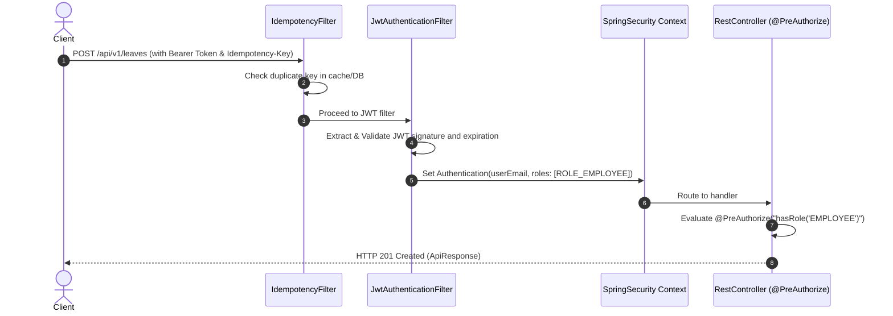
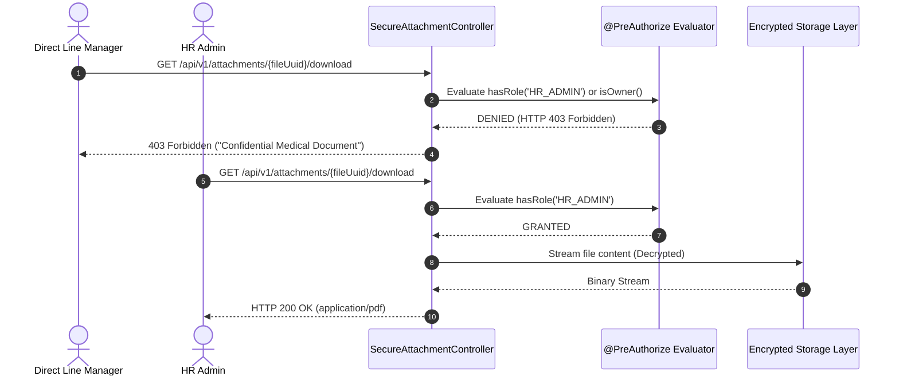

# Enterprise Leave Management System (LMS) - Technical Architecture Blueprint

**Status:** Approved Architecture Spine  
**Version:** 1.0.0  
**Date:** 2026-09-12  
**Architect:** Winston (System Architect)  
**Target Delivery:** Phase 1 MVP (Single-Tenant Enterprise)  

---

## 1. Architectural Principles & Invariants

This technical architecture translates the Product Requirements Document ([requirements.md](file:///d:/Project/leave-management/requirements.md)) into an implementable software design. It enforces four bedrock invariants:

1. **Leave as a Financial Ledger (Zero Silent Mutations):** Balances are never updated with naive SQL increments or decrements. Every balance shift is derived from an append-only, double-entry audit record in `leave_ledger_entry`.
2. **Deterministic Concurrency & Pessimistic Balance Locking:** To eliminate double-booking or balance overdraft race conditions during peak submission periods, every modification transaction acquires a row-level lock (`SELECT ... FOR UPDATE`) on the user's specific balance record.
3. **Statutory Confidentiality by Construction:** Medical attachments supporting sick leaves are isolated at the storage and API layer. Direct managers can verify attendance and certificate presence, but the actual file stream is strictly gated to `ROLE_HR_ADMIN` and the employee themselves.
4. **48h SLA & Automated State Escalation:** Approvals are treated as time-sensitive operational queues. An automated background scheduler monitors pending manager action, dispatches a 24-business-hour reminder, and transitions overdue requests to `ESCALATED` for Skip-Level / HR resolution.

---

## 2. System Architecture Diagram

```mermaid
graph TD
    subgraph Client Layer [React 18 + TypeScript + Ant Design]
        UI_EMP[Employee Dashboard & Calendar]
        UI_MGR[Manager Approvals Inbox & SLA Badges]
        UI_HR[HR Payroll & Policy Hub]
    end

    subgraph API Gateway & Security [Spring Security 6]
        SEC_FILTER[JwtAuthenticationFilter]
        RBAC_GUARD[MethodSecurityEvaluator @PreAuthorize]
        IDEM_FILTER[Idempotency-Key Filter]
    end

    subgraph Core Backend Services [Spring Boot 3.5.x]
        SRV_AUTH[AuthService & TokenManager]
        SRV_REQ[LeaveRequestService & Workflow State Machine]
        SRV_LEDGER[LeaveLedgerService & Pessimistic Lock Engine]
        SRV_CAL[Workday & Holiday Calculation Engine]
        SRV_FILE[SecureAttachmentService & Privacy Gate]
    end

    subgraph Background Schedulers [Spring Scheduling / Quartz]
        JOB_SLA[SLA Escalation & Reminder Job (15m)]
        JOB_ACCRUAL[Monthly Pro-Rata Accrual Job (1st/Month)]
    end

    subgraph Data & Storage Layer
        DB_MYSQL[(MySQL 8.0 InnoDB)]
        SEC_STORE[(Encrypted File System / S3 Private Bucket)]
    end

    UI_EMP --> SEC_FILTER
    UI_MGR --> SEC_FILTER
    UI_HR --> SEC_FILTER

    SEC_FILTER --> IDEM_FILTER
    IDEM_FILTER --> RBAC_GUARD

    RBAC_GUARD --> SRV_AUTH
    RBAC_GUARD --> SRV_REQ
    RBAC_GUARD --> SRV_LEDGER
    RBAC_GUARD --> SRV_CAL
    RBAC_GUARD --> SRV_FILE

    SRV_REQ --> SRV_LEDGER
    SRV_REQ --> SRV_CAL
    SRV_FILE --> SEC_STORE

    SRV_LEDGER -->|SELECT ... FOR UPDATE| DB_MYSQL
    SRV_REQ --> DB_MYSQL
    JOB_SLA --> SRV_REQ
    JOB_ACCRUAL --> SRV_LEDGER
```

---

## 3. Database Schema Design (MySQL 8.0 / InnoDB)

All tables use `InnoDB` with UTF8MB4 encoding, strict foreign key constraints, and dedicated indexes for high-frequency queries.

### 3.1 Physical Data Model (DDL)

```sql
-- 1. Departments
CREATE TABLE departments (
    id BIGINT AUTO_INCREMENT PRIMARY KEY,
    name VARCHAR(100) NOT NULL,
    department_code VARCHAR(20) NOT NULL UNIQUE,
    head_user_id BIGINT NULL,
    created_at TIMESTAMP DEFAULT CURRENT_TIMESTAMP,
    updated_at TIMESTAMP DEFAULT CURRENT_TIMESTAMP ON UPDATE CURRENT_TIMESTAMP
) ENGINE=InnoDB DEFAULT CHARSET=utf8mb4 COLLATE=utf8mb4_unicode_ci;

-- 2. Users (Employees, Managers, HR Admins)
CREATE TABLE users (
    id BIGINT AUTO_INCREMENT PRIMARY KEY,
    email VARCHAR(100) NOT NULL UNIQUE,
    password_hash VARCHAR(255) NOT NULL,
    full_name VARCHAR(100) NOT NULL,
    department_id BIGINT NOT NULL,
    manager_id BIGINT NULL,
    role ENUM('ROLE_EMPLOYEE', 'ROLE_MANAGER', 'ROLE_HR_ADMIN') NOT NULL DEFAULT 'ROLE_EMPLOYEE',
    employment_status ENUM('PROBATION', 'PERMANENT', 'RESIGNED') NOT NULL DEFAULT 'PROBATION',
    hire_date DATE NOT NULL,
    is_active BOOLEAN NOT NULL DEFAULT TRUE,
    created_at TIMESTAMP DEFAULT CURRENT_TIMESTAMP,
    updated_at TIMESTAMP DEFAULT CURRENT_TIMESTAMP ON UPDATE CURRENT_TIMESTAMP,
    CONSTRAINT fk_users_department FOREIGN KEY (department_id) REFERENCES departments(id),
    CONSTRAINT fk_users_manager FOREIGN KEY (manager_id) REFERENCES users(id),
    INDEX idx_users_manager (manager_id),
    INDEX idx_users_department (department_id),
    INDEX idx_users_role (role)
) ENGINE=InnoDB DEFAULT CHARSET=utf8mb4 COLLATE=utf8mb4_unicode_ci;

-- 3. Leave Types
CREATE TABLE leave_types (
    id BIGINT AUTO_INCREMENT PRIMARY KEY,
    code VARCHAR(30) NOT NULL UNIQUE, -- 'ANNUAL', 'SICK', 'UNPAID'
    name VARCHAR(100) NOT NULL,
    default_days_per_year DECIMAL(4, 2) NOT NULL DEFAULT 12.00,
    is_confidential_attachment BOOLEAN NOT NULL DEFAULT FALSE,
    requires_attachment_days INT NOT NULL DEFAULT 2, -- Trigger attachment prompt if >= days
    is_active BOOLEAN NOT NULL DEFAULT TRUE,
    created_at TIMESTAMP DEFAULT CURRENT_TIMESTAMP
) ENGINE=InnoDB DEFAULT CHARSET=utf8mb4 COLLATE=utf8mb4_unicode_ci;

-- 4. Leave Balances Summary (Used for Atomic Concurrency Locking)
CREATE TABLE leave_balances (
    id BIGINT AUTO_INCREMENT PRIMARY KEY,
    user_id BIGINT NOT NULL,
    leave_type_id BIGINT NOT NULL,
    accrued_days DECIMAL(5, 2) NOT NULL DEFAULT 0.00,
    carried_over_days DECIMAL(5, 2) NOT NULL DEFAULT 0.00,
    used_days DECIMAL(5, 2) NOT NULL DEFAULT 0.00,
    pending_days DECIMAL(5, 2) NOT NULL DEFAULT 0.00,
    version BIGINT NOT NULL DEFAULT 0, -- Optimistic locking fallback
    created_at TIMESTAMP DEFAULT CURRENT_TIMESTAMP,
    updated_at TIMESTAMP DEFAULT CURRENT_TIMESTAMP ON UPDATE CURRENT_TIMESTAMP,
    CONSTRAINT fk_balances_user FOREIGN KEY (user_id) REFERENCES users(id),
    CONSTRAINT fk_balances_leave_type FOREIGN KEY (leave_type_id) REFERENCES leave_types(id),
    UNIQUE KEY uk_user_leave_type (user_id, leave_type_id)
) ENGINE=InnoDB DEFAULT CHARSET=utf8mb4 COLLATE=utf8mb4_unicode_ci;

-- 5. Leave Attachments (Confidential Medical & Proof Documents)
CREATE TABLE leave_attachments (
    id BIGINT AUTO_INCREMENT PRIMARY KEY,
    file_uuid VARCHAR(64) NOT NULL UNIQUE,
    original_filename VARCHAR(255) NOT NULL,
    file_size_bytes BIGINT NOT NULL,
    content_type VARCHAR(100) NOT NULL,
    storage_path VARCHAR(500) NOT NULL,
    is_confidential BOOLEAN NOT NULL DEFAULT TRUE,
    uploaded_by_user_id BIGINT NOT NULL,
    created_at TIMESTAMP DEFAULT CURRENT_TIMESTAMP,
    CONSTRAINT fk_attachments_uploader FOREIGN KEY (uploaded_by_user_id) REFERENCES users(id)
) ENGINE=InnoDB DEFAULT CHARSET=utf8mb4 COLLATE=utf8mb4_unicode_ci;

-- 6. Leave Requests (Workflow State Machine)
CREATE TABLE leave_requests (
    id BIGINT AUTO_INCREMENT PRIMARY KEY,
    request_uuid VARCHAR(64) NOT NULL UNIQUE,
    idempotency_key VARCHAR(64) NULL UNIQUE,
    user_id BIGINT NOT NULL,
    leave_type_id BIGINT NOT NULL,
    start_date DATE NOT NULL,
    end_date DATE NOT NULL,
    start_half ENUM('MORNING', 'AFTERNOON') NOT NULL DEFAULT 'MORNING',
    end_half ENUM('MORNING', 'AFTERNOON') NOT NULL DEFAULT 'AFTERNOON',
    total_billable_days DECIMAL(4, 2) NOT NULL,
    reason TEXT NOT NULL,
    attachment_id BIGINT NULL,
    status ENUM('DRAFT', 'SUBMITTED', 'ESCALATED', 'APPROVED', 'REJECTED', 'CANCELLED', 'CANCEL_REQUESTED') NOT NULL DEFAULT 'SUBMITTED',
    assigned_approver_id BIGINT NULL, -- Direct Manager or Skip-Level/HR if escalated
    rejection_reason TEXT NULL,
    is_backdated BOOLEAN NOT NULL DEFAULT FALSE,
    reminder_sent BOOLEAN NOT NULL DEFAULT FALSE,
    submitted_at TIMESTAMP NOT NULL DEFAULT CURRENT_TIMESTAMP,
    escalated_at TIMESTAMP NULL,
    resolved_at TIMESTAMP NULL,
    created_at TIMESTAMP DEFAULT CURRENT_TIMESTAMP,
    updated_at TIMESTAMP DEFAULT CURRENT_TIMESTAMP ON UPDATE CURRENT_TIMESTAMP,
    CONSTRAINT fk_requests_user FOREIGN KEY (user_id) REFERENCES users(id),
    CONSTRAINT fk_requests_leave_type FOREIGN KEY (leave_type_id) REFERENCES leave_types(id),
    CONSTRAINT fk_requests_attachment FOREIGN KEY (attachment_id) REFERENCES leave_attachments(id),
    CONSTRAINT fk_requests_approver FOREIGN KEY (assigned_approver_id) REFERENCES users(id),
    INDEX idx_requests_user_status (user_id, status),
    INDEX idx_requests_approver_status (assigned_approver_id, status),
    INDEX idx_requests_sla_lookup (status, submitted_at, reminder_sent)
) ENGINE=InnoDB DEFAULT CHARSET=utf8mb4 COLLATE=utf8mb4_unicode_ci;

-- 7. Double-Entry Leave Ledger Entries (Immutable Audit Trail)
CREATE TABLE leave_ledger_entries (
    id BIGINT AUTO_INCREMENT PRIMARY KEY,
    transaction_uuid VARCHAR(64) NOT NULL UNIQUE,
    user_id BIGINT NOT NULL,
    leave_type_id BIGINT NOT NULL,
    request_id BIGINT NULL,
    amount DECIMAL(5, 2) NOT NULL, -- Signed: +1.00 (credit/accrual), -1.00 (debit/deduction)
    entry_type ENUM('ACCRUAL', 'RESERVATION', 'RESERVATION_RELEASE', 'DEDUCTION', 'EXPIRATION_FORFEIT', 'MANUAL_ADJUSTMENT') NOT NULL,
    balance_after DECIMAL(5, 2) NOT NULL,
    description VARCHAR(255) NOT NULL,
    actor_user_id BIGINT NOT NULL,
    created_at TIMESTAMP DEFAULT CURRENT_TIMESTAMP,
    CONSTRAINT fk_ledger_user FOREIGN KEY (user_id) REFERENCES users(id),
    CONSTRAINT fk_ledger_leave_type FOREIGN KEY (leave_type_id) REFERENCES leave_types(id),
    CONSTRAINT fk_ledger_request FOREIGN KEY (request_id) REFERENCES leave_requests(id),
    CONSTRAINT fk_ledger_actor FOREIGN KEY (actor_user_id) REFERENCES users(id),
    INDEX idx_ledger_user_type (user_id, leave_type_id)
) ENGINE=InnoDB DEFAULT CHARSET=utf8mb4 COLLATE=utf8mb4_unicode_ci;

-- 8. Public Holidays (Exempt from Leave Billable Days)
CREATE TABLE public_holidays (
    id BIGINT AUTO_INCREMENT PRIMARY KEY,
    holiday_date DATE NOT NULL UNIQUE,
    name VARCHAR(150) NOT NULL,
    calendar_year INT NOT NULL,
    description VARCHAR(255) NULL,
    created_at TIMESTAMP DEFAULT CURRENT_TIMESTAMP,
    INDEX idx_holidays_year (calendar_year, holiday_date)
) ENGINE=InnoDB DEFAULT CHARSET=utf8mb4 COLLATE=utf8mb4_unicode_ci;

-- 9. System Audit Logs
CREATE TABLE system_audit_logs (
    id BIGINT AUTO_INCREMENT PRIMARY KEY,
    entity_name VARCHAR(50) NOT NULL,
    entity_id BIGINT NOT NULL,
    action VARCHAR(50) NOT NULL,
    actor_user_id BIGINT NOT NULL,
    previous_state JSON NULL,
    new_state JSON NULL,
    ip_address VARCHAR(45) NULL,
    created_at TIMESTAMP DEFAULT CURRENT_TIMESTAMP,
    INDEX idx_audit_entity (entity_name, entity_id)
) ENGINE=InnoDB DEFAULT CHARSET=utf8mb4 COLLATE=utf8mb4_unicode_ci;
```

---

## 4. Concurrency Control & Double-Entry Ledger Engine

### 4.1 The Pessimistic Lock Protocol
When an employee submits a leave request, or a manager approves it, the backend executes the balance validation inside a `@Transactional(isolation = Isolation.READ_COMMITTED)` boundary:

```sql
-- Step 1: Acquire exclusive row lock on the user's specific balance record
SELECT id, accrued_days, carried_over_days, used_days, pending_days 
FROM leave_balances 
WHERE user_id = :userId AND leave_type_id = :leaveTypeId 
FOR UPDATE;

-- Step 2: Compute real-time available balance
-- Available = accrued_days + carried_over_days - used_days - pending_days;
-- Validate: Available >= :billableDays (HTTP 422 if insufficient)

-- Step 3: Insert immutable ledger reservation
INSERT INTO leave_ledger_entries (
    transaction_uuid, user_id, leave_type_id, request_id, 
    amount, entry_type, balance_after, description, actor_user_id
) VALUES (
    UUID(), :userId, :leaveTypeId, :requestId, 
    -:billableDays, 'RESERVATION', :newAvailableBalance, 'Leave request submitted', :actorUserId
);

-- Step 4: Update summary state
UPDATE leave_balances 
SET pending_days = pending_days + :billableDays, updated_at = NOW() 
WHERE id = :balanceId;
```

### 4.2 State Machine Transitions & Ledger Invariants

| Action | Current Status | Next Status | Balance Ledger Impact |
| :--- | :--- | :--- | :--- |
| **Submit Request** | `DRAFT` / None | `SUBMITTED` | Debit `Available`, Credit `pending_days` (`RESERVATION`) |
| **Approve Request** | `SUBMITTED` / `ESCALATED` | `APPROVED` | Debit `pending_days`, Credit `used_days` (`DEDUCTION`) |
| **Reject Request** | `SUBMITTED` / `ESCALATED` | `REJECTED` | Debit `pending_days`, Credit `Available` (`RESERVATION_RELEASE`) |
| **Cancel (Pre-Leave)** | `SUBMITTED` / `ESCALATED` | `CANCELLED` | Release `pending_days` back to `Available` |
| **Cancel (Pre-Start)** | `APPROVED` | `CANCELLED` | Credit `used_days` back to `Available` (`REVERSAL`) |
| **48h SLA Breach** | `SUBMITTED` | `ESCALATED` | **No ledger mutation.** Re-assign approver to Skip-Level/HR |

---

## 5. Spring Boot 3 Backend Architecture

### 5.1 Technology Stack & Versions
* **Runtime:** Java 25 LTS
* **Framework:** Spring Boot 3.5.x
* **Security:** Spring Security 6.x + jjwt (0.12.x)
* **Persistence:** Spring Data JPA + Hibernate 6.x + Flyway 10.x
* **Database Driver:** MySQL Connector/J 8.3+
* **Utilities:** Lombok, MapStruct 1.5+, Apache POI 5.2.x (Excel exports)

### 5.2 Package Structure

```
com.enterprise.lms
├── LmsApplication.java
├── common
│   ├── dto
│   │   ├── ApiResponse.java
│   │   └── ErrorResponse.java
│   ├── exception
│   │   ├── BusinessRuleException.java
│   │   ├── ConcurrencyConflictException.java
│   │   ├── EntityNotFoundException.java
│   │   └── GlobalExceptionHandler.java
│   └── filter
│       └── IdempotencyFilter.java
├── config
│   ├── AuditConfig.java
│   ├── SecurityConfig.java
│   ├── StorageConfig.java
│   └── WebMvcConfig.java
├── security
│   ├── CustomUserDetails.java
│   ├── CustomUserDetailsService.java
│   ├── JwtAuthenticationEntryPoint.java
│   ├── JwtAuthenticationFilter.java
│   ├── JwtTokenProvider.java
│   └── SecurityUtils.java
└── module
    ├── auth
    │   ├── controller.AuthController.java
    │   ├── dto.AuthRequest.java
    │   ├── dto.AuthResponse.java
    │   └── service.AuthService.java
    ├── user
    │   ├── controller.UserController.java
    │   ├── entity.User.java
    │   ├── repository.UserRepository.java
    │   └── service.UserService.java
    ├── leave
    │   ├── controller.LeaveRequestController.java
    │   ├── controller.LeaveLedgerController.java
    │   ├── dto.LeaveSubmissionDto.java
    │   ├── dto.ApprovalDecisionDto.java
    │   ├── entity.LeaveRequest.java
    │   ├── entity.LeaveBalance.java
    │   ├── entity.LeaveLedgerEntry.java
    │   ├── repository.LeaveRequestRepository.java
    │   ├── repository.LeaveBalanceRepository.java
    │   ├── repository.LeaveLedgerEntryRepository.java
    │   ├── service.LeaveRequestService.java
    │   ├── service.LeaveLedgerService.java
    │   └── service.LeaveCalculationService.java
    ├── attachment
    │   ├── controller.LeaveAttachmentController.java
    │   ├── entity.LeaveAttachment.java
    │   ├── repository.LeaveAttachmentRepository.java
    │   └── service.SecureAttachmentService.java
    ├── calendar
    │   ├── controller.CalendarController.java
    │   ├── entity.PublicHoliday.java
    │   ├── repository.PublicHolidayRepository.java
    │   └── service.CalendarService.java
    ├── scheduler
    │   ├── MonthlyAccrualScheduler.java
    │   └── SlaEscalationScheduler.java
    └── report
        ├── controller.PayrollReportController.java
        └── service.PayrollExportService.java
```

### 5.3 Spring Security + JWT Authentication Filters & RBAC Matrix



#### RBAC Matrix
| Endpoint / Resource | HTTP Method | `ROLE_EMPLOYEE` | `ROLE_MANAGER` | `ROLE_HR_ADMIN` |
| :--- | :--- | :---: | :---: | :---: |
| `/api/v1/auth/**` | POST | Public | Public | Public |
| `/api/v1/users/me` | GET | Own Profile | Own Profile | Full Access |
| `/api/v1/leaves/balances` | GET | Own Balance | Own Balance | Any Employee |
| `/api/v1/leaves/submit` | POST | Allowed | Allowed | Allowed |
| `/api/v1/leaves/{id}/cancel`| POST | Own Request | Own Request | Allowed |
| `/api/v1/approvals/pending` | GET | Forbidden (403) | Direct Reports | All + Escalated |
| `/api/v1/approvals/{id}/act`| POST | Forbidden (403) | Direct Reports | Direct / Escalated |
| `/api/v1/attachments/{uuid}/download` | GET | Own file only | **Forbidden (403)** | **Allowed** |
| `/api/v1/calendar/presence`| GET | Masked reasons | Masked reasons | Unmasked reasons |
| `/api/v1/reports/payroll` | GET | Forbidden (403) | Forbidden (403) | **Allowed (CSV/XLSX)** |

---

## 6. Background Schedulers: Accruals & SLA Triggers

Schedulers leverage `@EnableScheduling` with a dedicated `ThreadPoolTaskScheduler` (pool size: 5) configured for deterministic execution.

### 6.1 Monthly Accrual Scheduler (`MonthlyAccrualScheduler`)
* **Cron Expression:** `0 5 0 1 * ?` (Runs at 00:05 AM on the 1st day of every month).
* **Execution Logic:**
  1. Fetch active employees: `WHERE is_active = true AND employment_status IN ('PERMANENT', 'PROBATION')`.
  2. For `PROBATION` employees: Credit **1.00 day** pro-rata.
  3. For `PERMANENT` employees: Credit **1.66 days** (standard 20 days/year entitlement).
  4. Process in chunked transactions of 50 users per batch.
  5. Inserts `ACCRUAL` ledger entry and increments `accrued_days`.

### 6.2 SLA Warning & Auto-Escalation Scheduler (`SlaEscalationScheduler`)
* **Cron Expression:** `0 */15 * * * ?` (Runs every 15 minutes).
* **Business Hours Calendar:** Calculates business hours based on the Vietnam working week (Monday–Friday, 08:00–12:00 and 13:00–17:00, excluding dates in `public_holidays`).

#### Algorithm Flow:
```mermaid
graph TD
    A[Start SLA Scan: Every 15 min] --> B[Find all requests with status = SUBMITTED]
    B --> C{Start Date < 24h away OR Business Hours >= 24h?}
    C -->|Yes & reminder_sent = false| D[Dispatch 24h Warning Email/Alert to Direct Manager]
    D --> E[Set reminder_sent = true]
    C -->|No| F[Check 48h SLA]
    E --> F
    F --> G{Business Hours >= 48h?}
    G -->|Yes| H[Transition status: SUBMITTED -> ESCALATED]
    H --> I[Set escalated_at = NOW()]
    I --> J[Re-route task to Skip-Level Manager & HR Admin Queue]
    J --> K[Log to system_audit_logs & Dispatch Notification]
    G -->|No| L[Continue to next request]
    K --> L
```

---

## 7. Medical Attachment Privacy Architecture

Statutory sick leave notes contain sensitive personal health information (Protected Health Information / PHI).



### Storage Security Measures
1. **Zero Web-Root Exposure:** Files are stored in a non-executable directory (`/var/lms/secure_attachments/`) with restricted OS permissions (`chmod 700`), or an S3 bucket with private ACL.
2. **UUID File Obfuscation:** Stored filenames are hashed as random UUIDs (`3f8a4e1b-90a2-4a7b...dat`), preventing path traversal or enumeration attacks.
3. **MIME-Type Whitelisting:** Strictly enforces allowed upload types: `application/pdf`, `image/jpeg`, `image/png` (Max size: 5MB).

---

## 8. React 18 + Ant Design Frontend Architecture

### 8.1 Client Stack Selection
* **Bundler & Runtime:** Vite 5.x + React 18.3 + TypeScript 5.x
* **UI Library:** Ant Design (`antd` v5.x) with custom theme tokens
* **Server State & Caching:** TanStack Query (`@tanstack/react-query` v5.x)
* **HTTP Client:** Axios with JWT auto-refresh interceptors
* **Routing:** React Router v6
* **Date Manipulation:** `dayjs` with Vietnamese locale & business timezone (`Asia/Ho_Chi_Minh`)

### 8.2 Client Directory Structure

```
frontend/src/
├── api/
│   ├── apiClient.ts          # Axios instance with Bearer & 401 refresh token interceptors
│   ├── authApi.ts            # Login, logout, refresh endpoints
│   ├── leaveApi.ts           # Submit, balances, history, cancel
│   ├── approvalApi.ts        # Manager pending inbox, approve/reject
│   └── calendarApi.ts        # Team presence, holidays
├── components/
│   ├── common/
│   │   ├── AppHeader.tsx
│   │   ├── AppSidebar.tsx
│   │   ├── SlaCountdownChip.tsx # Visual urgency (Green >24h, Yellow <24h, Red Pulsing Escalated)
│   │   └── StatusBadge.tsx
│   ├── dashboard/
│   │   ├── BalanceMetricsCards.tsx
│   │   └── RecentRequestsTable.tsx
│   └── modal/
│       └── LeaveSubmissionModal.tsx # Dynamic form with conflict check
├── hooks/
│   ├── useAuth.ts
│   ├── useLeaveBalances.ts
│   └── useSlaTimer.ts
├── layouts/
│   ├── AuthLayout.tsx
│   └── MainLayout.tsx
├── pages/
│   ├── LoginPage.tsx
│   ├── EmployeeDashboardPage.tsx
│   ├── ManagerApprovalsPage.tsx
│   ├── TeamCalendarPage.tsx
│   └── HrPayrollExportPage.tsx
├── router/
│   ├── AppRouter.tsx
│   └── RoleGuard.tsx         # Route authorization wrapper
└── types/
    ├── auth.types.ts
    ├── leave.types.ts
    └── user.types.ts
```

### 8.3 State Management & Query Cache Strategy

```typescript
// TanStack Query Cache Configuration
export const queryKeys = {
  balances: ['leaves', 'balances'] as const,
  myRequests: (status?: string) => ['leaves', 'my-requests', status] as const,
  approvalsInbox: ['approvals', 'pending'] as const,
  teamCalendar: (year: number, month: number) => ['calendar', 'presence', year, month] as const,
  publicHolidays: (year: number) => ['calendar', 'holidays', year] as const,
};

// Automatic Invalidation on Request Submission
export const useSubmitLeave = () => {
  const queryClient = useQueryClient();
  return useMutation({
    mutationFn: (dto: LeaveSubmissionDto) => leaveApi.submitLeave(dto),
    onSuccess: () => {
      // Invalidate balance and requests to instantly update UI
      queryClient.invalidateQueries({ queryKey: queryKeys.balances });
      queryClient.invalidateQueries({ queryKey: ['leaves', 'my-requests'] });
      message.success('Leave request submitted successfully');
    },
  });
};
```

---

## 9. Architectural Validation & Review Checklist

Before handing this architecture to implementation, verify the following design invariants:

- [x] **No Balance Overdrafts:** Guarded by `leave_balances` row-level pessimistic write lock (`SELECT ... FOR UPDATE`).
- [x] **Audit Integrity:** All mutations create immutable records in `leave_ledger_entries`.
- [x] **Vietnamese Workday & Hours:** Calculations respect 08:00–12:00 and 13:00–17:00 with half-day 0.5 quantum.
- [x] **Probation Entitlement:** New hires accrue 1.0 day/month pro-rata and can spend accrued balances.
- [x] **SLA Auto-Escalation:** 24h reminder + 48h transition to `ESCALATED` re-routing to Skip-Level/HR.
- [x] **Medical Privacy:** Managers cannot access sick leave document downloads; restricted to `ROLE_HR_ADMIN`.
- [x] **Idempotency:** Request submission supports `Idempotency-Key` header to prevent double-submit network spikes.

---

*This document constitutes the binding technical contract for sprint planning and implementation.*
