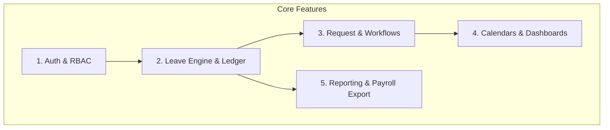
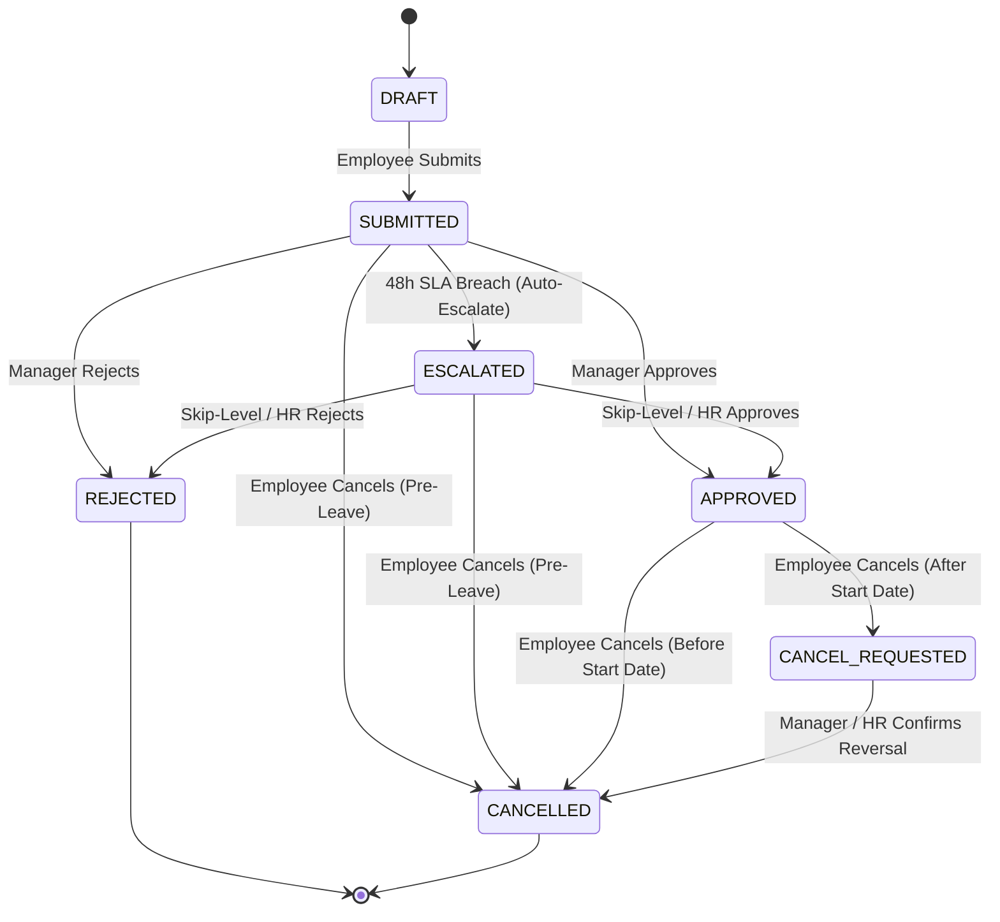

# PRD: Enterprise Leave Management System (LMS)

## 0. Document Purpose
This Product Requirements Document (PRD) establishes the authoritative functional and technical specifications for the internal web-based **Enterprise Leave Management System (LMS)**. It is written for engineering, product, QA, and HR operations stakeholders. It defines the system's behavioral contracts, domain glossary, user journeys, functional requirements (numbered FR-1 through FR-17), non-functional requirements (NFRs), explicit non-goals, and a structured 3-phase delivery roadmap starting with the Phase 1 Minimum Viable Product (MVP).

---

## 1. Vision & Core Philosophy

### 1.1 Executive Summary
Managing employee time-off in an enterprise is frequently plagued by fragmented email chains, fragile spreadsheets, statutory labor compliance breaches, and lack of visibility into team capacity. The **Enterprise Leave Management System (LMS)** replaces these legacy processes with a centralized, automated, and transactionally secure web application. 

### 1.2 Core Philosophy: "Leave as a Financial Ledger"
In enterprise HR, leave days represent a measurable financial and legal liability. A single dropped half-day, inaccurate carry-over calculation, or race condition during simultaneous submissions erodes employee trust and causes payroll friction. Consequently, this system treats **leave balances with the mathematical precision of a double-entry banking ledger**:
1. **Zero Silent Mutations:** Balances are never updated without a corresponding debit, credit, or compensating transaction record.
2. **Strict Concurrency Safety:** Every deduction is guarded by transactional database locks to prevent balance overdrafts or double-spending.
3. **Role-Enforced Confidentiality:** Colleagues see presence; managers see request timelines; only authorized HR personnel see medical notes and statutory documentation.

---

## 2. Target Users & User Journeys

### 2.1 Personas & Roles
* **Employee (Self-Service User):** Individual contributors across all departments seeking fast submission, transparency into balance accruals, and team schedule visibility.
* **Direct Line Manager:** Team leads and engineering/department managers responsible for maintaining operational coverage while approving or rejecting leave requests.
* **Department Head / Skip-Level Manager:** Senior leaders overseeing multiple squads or cross-functional departments requiring visibility into department-wide leave trends and escalation handling.
* **HR Administrator:** People Operations specialists managing company leave policies, holiday calendars, balance audits, and payroll cutoff reports.
* **System Administrator:** IT engineers managing user provisioning, roles, and global system configuration.

---

### 2.2 Jobs To Be Done (JTBD)
* **When I am planning personal time off or fall ill (Employee),** I want to view my real-time available balances, check conflicting team schedules, and submit a request in under 60 seconds, so that I can take time off with full peace of mind.
* **When my direct report submits a leave request (Direct Manager),** I want to evaluate the request with clear team coverage insights and approve/reject with a single click, so that project deadlines are never jeopardized by unexpected absences.
* **When end-of-month payroll processing arrives (HR Admin),** I want to generate an audit-ready, tamper-proof report of paid/unpaid leave deductions and accruals, so that employee compensation is 100% accurate and compliant with labor laws.

---

### 2.3 Key User Journeys (UJ)

#### UJ-1: Sarah Submits an Annual Leave Request with Conflict Checking
* **Persona & Context:** Sarah, Senior Software Engineer on the Checkout Squad. Planning a 4-day vacation around a long weekend.
* **Entry State:** Authenticated via JWT, navigates to the Personal Dashboard on web.
* **Path:**
  1. Sarah views her Personal Leave Card: shows 14.5 Annual Leave days available.
  2. She clicks "Request Leave" and selects **Annual Leave**.
  3. She selects the date range: Thursday to Tuesday. The system automatically cross-references the Public Holiday Calendar (Monday is a national holiday) and calculates **3 billable days** (not 4).
  4. The submission modal displays a live Team Mini-Calendar: shows one peer on leave Friday. The coverage indicator stays green (>70% team available).
  5. Sarah adds a brief handover note ("Covered by Alex") and clicks **Submit**.
* **Climax:** The system issues a success notification, changes the balance status from *14.5 Available* to *11.5 Available (3 Days Pending Approval)*, and sends an automated notification to Sarah's manager.
* **Resolution:** Sarah monitors request status on her dashboard tracker.
* **Edge Case:** If Sarah submits a request overlapping another pending/approved request of her own, the system rejects submission with a client-side and server-side conflict error.

#### UJ-2: David Reviews, Evaluates Coverage, and Approves a Request
* **Persona & Context:** David, Engineering Manager managing 8 direct reports.
* **Entry State:** Authenticated, receives an email/in-app badge notifying him of Sarah's request.
* **Path:**
  1. David opens his **Manager Approvals** inbox.
  2. He clicks Sarah's request card. The interface presents:
     * Request details: Annual Leave, 3 days, dates, handover note.
     * Team Overlap Widget: Visual timeline showing the Checkout Squad's attendance for those dates.
  3. David confirms team coverage is well within acceptable limits.
  4. He clicks **Approve** and enters an optional comment ("Have a great break!").
* **Climax:** The request status transitions immediately to `APPROVED`. Sarah's 3 days transition from *Pending* to *Debited*.
* **Resolution:** Sarah receives an approval confirmation; the Team Calendar reflects her approved absence; David's approval inbox clears.

#### UJ-3: Elena (HR Admin) Performs Monthly Accrual Run & Payroll Export
* **Persona & Context:** Elena, HR Operations Specialist, closing out the calendar month.
* **Entry State:** Authenticated as HR Admin, navigates to **HR Management $\rightarrow$ Payroll & Reports**.
* **Path:**
  1. Elena runs the monthly scheduled balance accrual verification. The system calculates monthly pro-rated accruals (+1.66 days for standard FTEs) across active employees.
  2. Elena reviews the automated discrepancy log (flags: zero discrepancies, 2 new hires pro-rated, 1 unpaid leave deduction).
  3. She selects date range `2026-09-01` to `2026-09-30`, formats as CSV/Excel, and clicks **Generate Payroll Deduction Report**.
* **Climax:** The system generates an encrypted, immutable export containing employee IDs, leave categories, unpaid days, and net balance adjustments.
* **Resolution:** Elena hands the file off to the finance payroll team.

#### UJ-4: Marcus Submits Emergency Sick Leave with Confidential Medical Document
* **Persona & Context:** Marcus, Product Specialist, waking up with severe food poisoning requiring emergency hospital treatment.
* **Entry State:** Authenticated on mobile browser.
* **Path:**
  1. Marcus submits a **Sick Leave** request for today and tomorrow.
  2. Because the company policy requires a medical certificate for sick leave $\ge$ 2 consecutive days, the form prompts for an attachment.
  3. Marcus takes a photo of his hospital discharge summary and uploads it (PDF/JPEG, max 5MB).
  4. The request is submitted directly into `PENDING_HR_VERIFICATION`.
* **Climax:** Marcus's manager David sees that Marcus is on Sick Leave on the Team Calendar, but **the medical attachment is hidden from David**. Only Elena (HR Admin) can view and verify the hospital certificate.
* **Resolution:** Marcus rests without worrying about privacy violations; HR verifies the medical note and marks the request valid.

---

## 3. Glossary & Domain Model

| Term | Definition & Rules |
| :--- | :--- |
| **Leave Balance Ledger** | The double-entry audit table recording every credit (accrual, tenure bonus, manual grant) and debit (leave deduction, carry-over forfeiture) per employee and leave category. |
| **Accrual Cycle** | The recurring schedule (e.g., 1st of every month) where the system computes and credits fractional leave days based on employment contract and tenure. |
| **Available Balance** | $\text{Available} = \text{Accrued} + \text{CarryOver} - \text{Approved} - \text{PendingApproval}$. Available balance cannot drop below 0 in MVP. |
| **Leave Type** | Category of leave with distinct entitlement rules: *Annual Leave*, *Sick Leave*, *Unpaid Leave*, *Maternity/Paternity*, *Compassionate Leave*, *Remote Work*. |
| **Holiday Calendar** | System-configured schedule of national, state, or company non-working days. Excluded from leave day deductions. |
| **Half-Day Quantum** | The atomic unit of leave deduction (0.5 days): Morning (08:00–12:00) or Afternoon (13:00–17:00) based on standard 8-hour Vietnamese working day (08:00–12:00, 12:00–13:00 lunch/nap break, 13:00–17:00). |
| **Approval SLA Window** | Strict time limit (48 business hours, or 24h prior to leave start date) within which a manager must resolve a request. |
| **Escalated Status** | State assumed when a leave request breaches the 48-business-hour manager SLA without resolution; automatically re-assigned to the Skip-Level Manager (Department Head) and HR Admin queue. |
| **Approval Delegation** | A temporary re-assignment of a manager's approval authority to another manager during their scheduled absence. |
| **Pessimistic Balance Lock** | A database-level transactional lock (`SELECT ... FOR UPDATE`) held during leave submission/approval to eliminate balance double-spending. |
| **Backdated Request** | A leave request whose start date occurs in the past. Requires mandatory HR justification and special approval routing. |

---

## 4. Features & Functional Requirements

### 4.1 Authentication & Role-Based Access Control (RBAC)
**Description:** Provides secure authentication, session management, and fine-grained role-based authorization for all internal employees. Realizes UJ-1, UJ-2, UJ-3, UJ-4.

#### FR-1: User Authentication & JWT Session Management
* Users can authenticate using email and password via Spring Security.
* The system returns a stateless JWT access token (short-lived, 15–60 min) and a refresh token (HttpOnly, Secure cookie, 7 days).
* **Consequences (Testable):**
  * Unauthenticated requests to protected endpoints return HTTP 401 Unauthorized.
  * Expired access tokens can be refreshed without requiring user credentials re-entry if the refresh token is valid.
  * Failed login attempts exceed 5 consecutive times triggers a 15-minute temporary lockout.

#### FR-2: Role-Based Authorization & Hierarchies
* The system supports three standard roles for MVP: `ROLE_EMPLOYEE`, `ROLE_MANAGER`, `ROLE_HR_ADMIN`.
* **Consequences (Testable):**
  * `ROLE_EMPLOYEE` can only access their own profile, balances, requests, and team calendar.
  * `ROLE_MANAGER` can access and approve requests for their direct reporting lines.
  * `ROLE_HR_ADMIN` has read/write access to company-wide policies, balances, holiday calendars, and reporting.
  * Privilege escalation attempts return HTTP 403 Forbidden.

#### FR-3: User Profile & Organizational Hierarchy Mapping
* Every user record contains: `userId`, `email`, `fullName`, `departmentId`, `managerId`, `hireDate`, `employmentStatus`.
* The system constructs the management reporting tree based on `managerId`.

---

### 4.2 Leave Engine & Policy Management
**Description:** The transactional backbone of the system. Maintains the balance ledger, computes automated accruals, deducts holidays, and enforces policy constraints. Realizes UJ-1, UJ-3.

#### FR-4: Double-Entry Balance Ledger
* All balance changes are stored in an append-only `leave_ledger_entry` table.
* The balance is computed deterministically as the sum of ledger entries.
* **Consequences (Testable):**
  * Direct updates (`UPDATE leave_balance SET days = ...`) are prohibited in the data access layer.
  * Every ledger entry contains `transaction_id`, `user_id`, `leave_type_id`, `amount` (+/-), `transaction_type` (ACCRUAL, DEDUCTION, ADJUSTMENT, REVERSAL), and `created_at`.

#### FR-5: Concurrency Safety & Overdraft Prevention
* During submission or approval, the engine acquires a database lock on the user's balance row.
* **Consequences (Testable):**
  * Simultaneous requests submitted via concurrent threads for an employee with 1 remaining day will result in exactly one successful request and one rejection with `INSUFFICIENT_BALANCE`.
  * The available balance cannot drop below 0.0 (MVP constraint: negative balances prohibited).

#### FR-6: Automated Monthly Accruals & Pro-Rata Engine
* The system executes a monthly batch job on the 1st day of every month to credit monthly accrual (e.g., Annual Leave = 1.66 days/month for 20 days/year).
* New employees joining mid-month receive pro-rated accruals based on remaining working days in their initial month.
* **Probation Period Entitlement:** New hires during their standard 3-month probation period accrue annual leave pro-rata (1.0 day/month) and are authorized to submit and consume accrued leave days during probation (aligned with Vietnamese Labor Code & big-tech enterprise standards).

#### FR-7: Public Holiday & Working Days Deduction Calculation
* The system maintains a global Public Holiday Calendar.
* **Standard Working Schedule (Vietnamese Business Hours):**
  * Working days: Monday through Friday (8 working hours/day, 40 hours/week).
  * Morning shift: 08:00 – 12:00 (4 working hours).
  * Lunch / Nap break: 12:00 – 13:00 (1 hour non-working rest).
  * Afternoon shift: 13:00 – 17:00 (4 working hours).
* When computing leave duration:
  * Weekends (Saturday, Sunday) are excluded.
  * Public holidays falling within the date range are excluded.
  * Half-day leaves are counted as exactly 0.5-day quantitative deduction, mapped to Morning (08:00–12:00) or Afternoon (13:00–17:00).
* **Consequences (Testable):**
  * A request from Friday through Monday where Monday is a public holiday deducts exactly 1.0 day (Friday).

---

### 4.3 Request & Multi-Level Approval Workflows
**Description:** Guides leave requests through submission, validation, approval, escalation, and cancellation state machines. Realizes UJ-1, UJ-2, UJ-4.

#### FR-8: Dynamic Leave Request Submission Form
* Employees can submit leave by selecting: `leaveTypeId`, `startDate`, `endDate`, `startHalf` (AM/PM), `endHalf` (AM/PM), `reason`, and optional `attachment`.
* **Consequences (Testable):**
  * Form automatically validates: `startDate <= endDate`.
  * Date range cannot overlap with existing `SUBMITTED`, `ESCALATED`, or `APPROVED` requests for the same employee.
  * If selected days exceed `Available Balance`, client disables submission and API returns HTTP 422 Unprocessable Entity.

#### FR-9: 1-Tier Approval Routing with 48h SLA & Auto-Escalation
* Upon submission, the request enters `SUBMITTED` status and is assigned to the employee's `managerId`.
* **Approval SLA & Escalation Engine:**
  * **SLA Window:** Direct Managers must act within 48 business hours from submission (or at least 24 hours prior to the leave start date, whichever is earlier).
  * **24-Hour Reminder:** Automated notification and email dispatched at the 24-business-hour mark if the request remains in `SUBMITTED` state.
  * **48-Hour Auto-Escalation:** If unresolved at the 48-business-hour mark, the background scheduler automatically transitions the request to `ESCALATED` status and re-routes it to the Skip-Level Manager (Department Head) and HR Admin queue.
* Skip-Level Managers and HR Admins have full authority to review, approve, or reject `ESCALATED` requests.
* Manager/approver must supply a mandatory reason if rejecting a request.

#### FR-10: Confidential Medical Attachment Handling
* For Sick Leave requests, employees can upload supporting medical documents (PDF, JPEG, PNG, max 5MB).
* **Consequences (Testable):**
  * File storage metadata is stored with an access-control flag `is_confidential = true`.
  * Direct Managers can view request dates and medical status indicator ("Medical Certificate Attached: Yes"), but **cannot download or view the file**.
  * Only `ROLE_HR_ADMIN` users can access the document download URL.

#### FR-11: Pre-Leave and Post-Leave Cancellation
* An employee can unilaterally cancel an `APPROVED` leave request **prior to the start date**. The system immediately credits the reserved days back to the available balance.
* If the leave has already started or elapsed, cancellation requires manager approval (`CANCEL_REQUESTED`).

#### FR-12: Backdated Leave Request Handling
* If `startDate < currentDate`, the system flags the request as `BACKDATED`.
* Backdated requests require a mandatory detailed justification and must be approved by both the Direct Manager and HR Admin.

---

### 4.4 Real-Time Calendars & Dashboards
**Description:** High-performance visual dashboards built with React and Ant Design for personal and team visibility. Realizes UJ-1, UJ-2.

#### FR-13: Individual Employee Dashboard
* Displays real-time metric cards:
  * **Annual Leave:** Accrued, Used, Pending, Remaining.
  * **Sick Leave:** Used / Total Entitlement.
  * **Recent Requests Table:** Filterable by status (`SUBMITTED`, `ESCALATED`, `APPROVED`, `REJECTED`, `CANCELLED`).
  * **Upcoming Company Holidays:** Next 30 days list.

#### FR-14: Interactive Team Presence Calendar
* Built using Ant Design Calendar/Grid component.
* Displays a monthly/weekly view of department members on leave or working.
* **Privacy Guard:** Colleague leave cards display only "Out of Office / Leave" and duration. Confidential reasons (e.g., "Surgery", "Bereavement") are masked for non-managerial peers.

#### FR-15: Manager Approvals Inbox & Conflict Visualizer
* Dedicated inbox for managers with batch or individual approve/reject controls.
* Includes SLA urgency badges (Normal, Approaching 24h Warning, Escalated).
* Includes a Team Overlap Warning indicator when multiple reports request overlapping dates.

---

### 4.5 Audit Trail, Reporting & Payroll Export
**Description:** Provides immutable auditing and standard data export capabilities for business compliance. Realizes UJ-3.

#### FR-16: Immutable System Audit Log
* Every state transition (`SUBMIT`, `APPROVE`, `REJECT`, `CANCEL`, `MANUAL_ADJUSTMENT`) generates an immutable audit record containing `timestamp`, `actorUserId`, `targetUserId`, `action`, `previousState`, `newState`, `ipAddress`.
* Audit records cannot be modified or deleted via API.

#### FR-17: Monthly Payroll Deduction & Accrual Export
* HR Admin can export leave records filtered by department and pay period.
* Output formats: CSV and Microsoft Excel (`.xlsx`).
* Report includes: `EmployeeID`, `EmployeeName`, `Department`, `UnpaidLeaveDays`, `PaidLeaveDaysTaken`, `ClosingBalance`.

---

## 5. Explicit Non-Goals (v1 / MVP)
To guarantee rapid delivery, high stability, and zero architectural bloat, the following capabilities are **strictly out of scope for Phase 1 MVP**:

* **[NON-GOAL] Multi-Tenancy:** The application is built for a single company/organization. No tenant isolation layers or dynamic database routing.
* **[NON-GOAL] External Calendar Bi-directional Sync:** No automated CalDAV or Google Calendar two-way synchronization in MVP (Phase 2).
* **[NON-GOAL] Slack/Teams Interactive Bots:** Notifications will use standard email and in-app feeds; interactive chat bot approvals are deferred to Phase 2.
* **[NON-GOAL] AI Holiday Bridge Assistant:** Generative AI / heuristic bridge suggestions are deferred to Phase 3.
* **[NON-GOAL] Mobile Native Apps:** The frontend is a responsive web application (React + Ant Design) accessible via desktop and mobile browsers; no React Native / Flutter apps.
* **[NON-GOAL] Direct Payroll API Integration:** No live API push to Workday, ADP, or BambooHR; payroll integration operates via CSV/Excel export.

---

## 6. MVP Scope & 3-Phase Roadmap

| Capability Cluster | Phase 1: MVP (Core Engine) | Phase 2: Enterprise Ops | Phase 3: Intelligence & Scale |
| :--- | :--- | :--- | :--- |
| **Tenancy** | Single-Tenant Internal Web App | Single-Tenant Modular | Multi-Tenant Commercial SaaS |
| **Auth & RBAC** | Spring Security JWT; 3 Roles (Employee, Manager, HR Admin) | SSO Integration (OAuth2 / Google / M365); Dept Head Role | SAML 2.0 / Okta / Azure AD SCIM user provisioning |
| **Leave Types** | Annual, Sick, Unpaid | Maternity/Paternity, Compassionate, Remote | Custom organization-defined leave policy builder |
| **Accrual Rules** | Standard monthly accruals, pro-rated new hires | Carry-over expiration, tenure bonuses, probation freeze | Dynamic multi-jurisdiction labor compliance rules |
| **Approval Flow** | 1-Tier (Direct Manager) with 48h SLA & Auto-Escalation to Skip-Level/HR + HR Medical gate | Multi-Tier (Manager $\rightarrow$ Dept Head) + Delegation + Configurable SLAs | Dynamic DAG workflow engine with auto-escalation |
| **Integrations** | In-app alerts + SMTP Email notifications | Slack/Teams Webhooks + iCal subscription feeds | Bi-directional API connectors (Workday, ADP, Deel) |
| **Intelligence** | Basic team overlap visualizer | Departmental threshold warning (>30% on leave) | AI Leave Assistant (holiday bridge recommendations) |
| **Reporting** | CSV / Excel Payroll Export | Advanced HR Analytics & Trend Dashboard | Automated scheduled payroll dispatch & predictive capacity |

---

## 7. Cross-Cutting Non-Functional Requirements (NFRs)

### 7.1 Performance & Latency
* **NFR-1 (P95 Latency):** Read operations (Dashboard load, Calendar view) must respond in $< 300\text{ms}$ at P95 under standard enterprise load (up to 5,000 active employees).
* **NFR-2 (Write Transactions):** Leave submission and approval transactions must commit in $< 500\text{ms}$ including ledger updates and pessimistic lock release.

### 7.2 Security & Data Privacy
* **NFR-3 (Password Storage):** Passwords hashed using BCrypt with a minimum work factor of 12.
* **NFR-4 (Stateless Tokens):** JWT signatures validated using HMAC-SHA256 or RSA-256 with secrets managed via environment variables.
* **NFR-5 (Medical Privacy):** Attachment endpoints enforce role-scoped checks verifying that only the file owner or an HR Admin can download files.
* **NFR-6 (Transport Security):** Enforce HTTPS/TLS 1.3 across all endpoints.

### 7.3 Concurrency & Reliability
* **NFR-7 (Zero Double-Spend):** Database transaction isolation set to `READ_COMMITTED` with explicit pessimistic locking (`SELECT ... FOR UPDATE`) on balance ledger rows during modification.
* **NFR-8 (Idempotency):** Request submission API accepts a client-generated `Idempotency-Key` header to prevent duplicate submissions from rapid UI clicking.

### 7.4 Usability & Accessibility
* **NFR-9 (Component Library):** Frontend standardizes on Ant Design (v5+) adhering to WCAG 2.1 Level AA color contrast standards.
* **NFR-10 (Responsive Layout):** Clean layout support across desktop monitors ($\ge 1280\text{px}$), tablets, and mobile browser viewports ($\ge 375\text{px}$).

---

## 8. Technical Architecture Blueprint (Addendum)

### 8.1 Technology Stack Selection
* **Backend:** Java 25 LTS, Spring Boot 3.5.x
  * Spring Web (RESTful APIs)
  * Spring Security + JWT
  * Spring Data JPA & Hibernate
  * Spring Batch / Scheduled Tasks (for monthly accrual runs)
  * Lombok, MapStruct, Bean Validation
* **Database:** MySQL 8.0+
  * InnoDB storage engine (strict foreign keys, row-level locking, ACID transactions)
  * Flyway or Liquibase for database schema migration tracking
* **Frontend:** React 18+ with TypeScript
  * UI Framework: Ant Design (`antd`)
  * State Management & Server Cache: TanStack Query (React Query) + Axios
  * Routing: React Router v6
  * Date/Time Utilities: `dayjs`
* **Build & Containerization:**
  * Maven / Gradle for Spring Boot
  * Vite for React application bundling
  * Docker & Docker Compose for local development orchestration

---

## 9. Success Metrics (SM)

### Primary Metrics
* **SM-1 (Adoption & Efficiency):** $95\%$ of all leave requests submitted and resolved through LMS within the first 30 days of rollout (eliminating spreadsheet/email requests). Validates FR-8, FR-9.
* **SM-2 (Approval Velocity):** Median time from request submission to manager resolution $< 24\text{ hours}$. Validates FR-9, FR-15.
* **SM-3 (Ledger Integrity):** $0.0\%$ ledger balance discrepancy rate during monthly HR reconciliation runs. Validates FR-4, FR-5, FR-17.

### Counter-Metrics (Do Not Optimize At Cost Of)
* **SM-C1 (Employee Fatigue vs. Approval Speed):** Do not optimize approval speed by auto-approving requests without manager evaluation; auto-approval leads to undetected understaffing.
* **SM-C2 (Strictness vs. Emergency Flexibility):** Do not optimize against negative balances by blocking emergency sick leave submissions; emergency sick leave must support retroactive HR review.

---

## 10. Open Questions & Assumptions Index

### Assumptions
* `[ASSUMPTION-1]`: Standard full-time employees work Monday through Friday, 8 hours per day (08:00–12:00, 12:00–13:00 lunch/nap break, 13:00–17:00) following Vietnamese corporate/big-tech standard hours.
* `[ASSUMPTION-2]`: Public holidays are identical company-wide for MVP (multi-regional holiday schedules will be introduced in Phase 2).
* `[ASSUMPTION-3]`: Medical certificates are mandatory for sick leaves exceeding 2 consecutive working days.
* `[ASSUMPTION-4]`: Unused annual leave carry-over policy allows up to a maximum of 5 days carried into the next calendar year, expiring on March 31st.

### Resolved Business Policy Decisions (Vietnamese Tech Enterprise Standard)
1. **Probation Policy [RESOLVED]:** New hires in their standard 3-month probation period accrue annual leave on a pro-rata basis (1.0 day/month) and CAN use accrued annual leave during probation without waiting for official labor contract confirmation. Unused accrued leave rolls over into regular status upon passing probation.
2. **Half-Day Quantum & Working Hours [RESOLVED]:** A half-day is strictly a 0.5-day quantitative balance deduction (not bound to rigid clock punches, but mapped to operational shifts):
   * **Morning Half-Day (0.5):** 08:00 – 12:00 (4 working hours).
   * **Lunch / Nap Break:** 12:00 – 13:00 (1 non-working rest hour).
   * **Afternoon Half-Day (0.5):** 13:00 – 17:00 (4 working hours).
   * A full working day is 8 hours (08:00–17:00 with 1-hour rest). Weekend days (Saturday, Sunday) are non-working days.
3. **Approval SLA & Auto-Escalation [RESOLVED]:**
   * **SLA Window:** Direct Managers must act within **48 business hours** from submission (or at least 24 hours prior to the leave start date, whichever is earlier).
   * **Automated 24h Warning:** The system dispatches an urgent reminder notification/email to the manager at the 24-business-hour mark.
   * **48h Auto-Escalation:** If unresolved after 48 business hours, the system transitions the request status to `ESCALATED` and automatically re-routes the approval task to the **Skip-Level Manager (Department Head)** and **HR Admin** queues.
